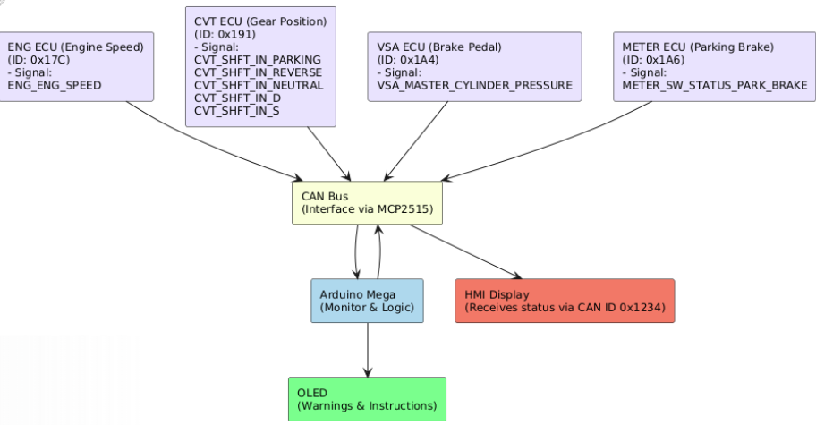
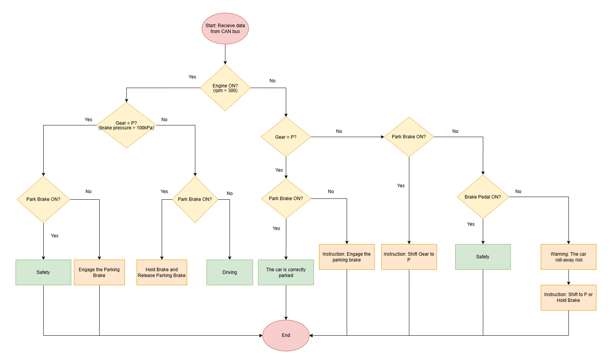

 # CodeRace2025 weCAN

 ## 1. Overview
 In this project, we built an embedded safety support system for real vehicle (Honda City 2018), designed to assist new or inexperienced drivers during critical moments: engine start-up and parking. The system detects unsafe driving conditions using standard CAN bus signals and provides real-time feedback via an OLED and Dashboard display.

 ## 2. Motivation
 Driving at the beginning and end of a trip—when starting the engine or parking—is often challenging for inexperienced drivers. Misjudgments during these moments can lead to:
 - Gear misuse
 - Engine strain
 - Risk of vehicle roll-away

 This project demonstrates how low-cost embedded systems can enhance driver safety by utilizing existing vehicle infrastructure.

 ## 3. Key Features
   

 - **Gear Detection:** Via CAN ID 0x191, identifies gear state: P (Parking), R (Reverse), N (Neutral), D (Drive), S (Sport).
 - **Engine Status Monitoring:** Via CAN ID 0x17C, distinguishes between Pre-Ignition, Ignition, and OFF.
 - **Brake Status Monitoring:** Via CAN ID 0x1A4, 0x1A6, detects brake pedal and hand brake engagement.
 - **Real-Time Feedback:** Intuitive warnings displayed on a compact OLED screen.
 - **Minimal Hardware Setup:** Arduino-compatible MCU, MCP2515 CAN module, SH1106 OLED.

## 4. Flowchart
   
### System Logic Flowchart (Summary)
1. Receive CAN data every 0.5 seconds: engine status, gear position, brake.
2. Check engine status:
	- If engine is ON:
	  - If just started and gear is in P → Display brake reminder.
	- If engine is OFF:
	  - If gear is not in P → Display parking warning and instruction to shift to P or hold brake.
3. If none of the above conditions are met → No warning is shown.

**Warnings:**
- Startup: "Press the brake pedal fully before shifting gears."
- Parking: "The car roll-away risk."
- Instruction: "Shift to P mode or Hold Brake"

## 5. Modules (for simulation and real implementation)
### Hardware
 - **Arduino Mega 2560:** Central node for receiving CAN messages, interpreting signals, and managing display logic.
 - **Arduino Nano:** Dedicated CAN message simulator, emulating gear-related signals via a 4x4 matrix keypad.
 - **MCP2515 CAN Bus Module (x2):** One for receiving, one for simulating CAN messages.
 - **4x4 Matrix Keypad:** User input for gear simulation.
 - **SH1106 OLED Display (128x64):** Displays real-time driving status and safety reminders.
 - **SPI and I2C Wiring:** Efficient integration of input/output devices.

### Tools
- **Arduino IDE:** For programming the microcontrollers.
- **Candb++:** Used to read bits and signal IDs from **.dbc** data files, helping identify bit and byte positions of CAN signals.
- **SavyCAN:** Used to decode and simulate reading CAN data from **.csv** files, supporting analysis and testing of CAN traffic.

## 6. Conclusion
This project successfully demonstrates how embedded systems can enhance vehicle safety by providing real-time feedback to drivers during critical moments. By leveraging CAN bus data, we can identify unsafe conditions and offer timely warnings, ultimately contributing to safer driving habits for new or inexperienced drivers.

